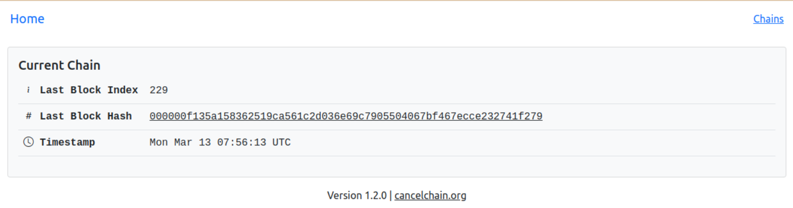
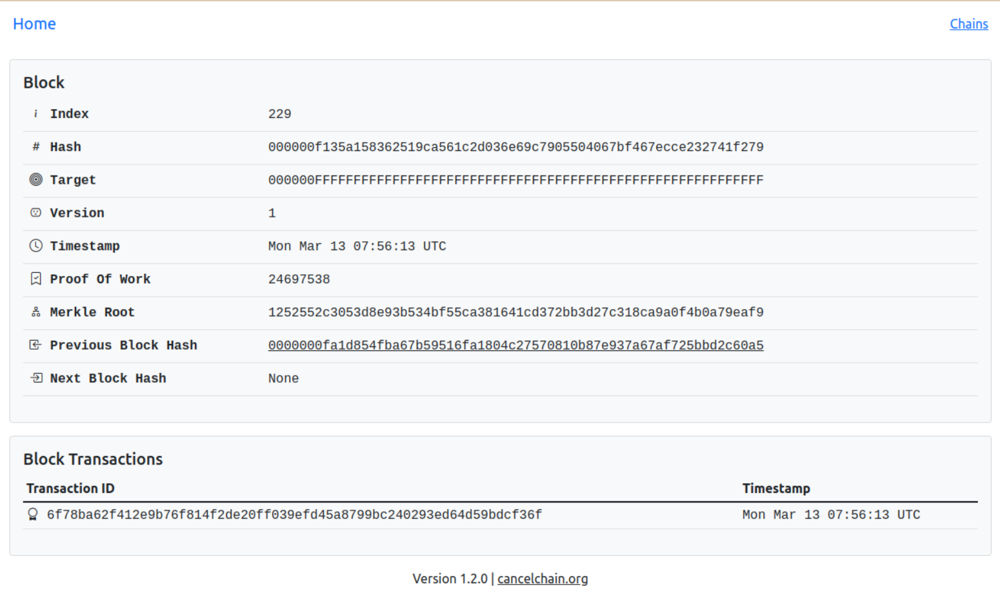
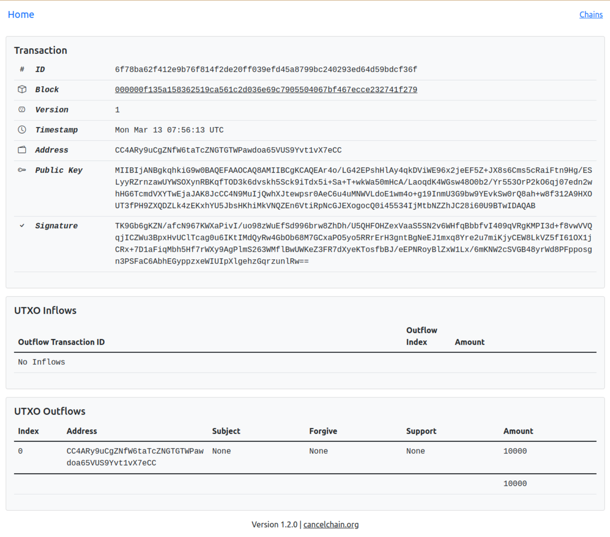

CancelChain
###########

CancelChain is an open-source python project that implements a custom blockchain ledger. The ledger protocol allows for the assigning of tokens to subjects (utf-8 strings of less than 80 characters) as indications of either opposition or support. Opposition entries are allowed to be rescinded later. Support is forever.

* `Project Home Page`_
* `Documentation`_
* `Blog`_

Quick Start
===========

Requirements
------------

Python >= 3.9

Installation
------------

Install CancelChain using pip:

.. code-block:: console

  $ pip install cancelchain

It is recommended that a `python virtual environment`_ is used for `all <https://realpython.com/python-virtual-environments-a-primer/#avoid-system-pollution>`__ `the <https://realpython.com/python-virtual-environments-a-primer/#sidestep-dependency-conflicts>`__ `usual <https://realpython.com/python-virtual-environments-a-primer/#minimize-reproducibility-issues>`__ `reasons <https://realpython.com/python-virtual-environments-a-primer/#dodge-installation-privilege-lockouts>`_.

Configuration
-------------

Create a `python-dotenv`_ ``.env`` file. Here is an example minimal configuration:

.. code-block:: console

  # Flask Settings
  FLASK_APP=cancelchain
  FLASK_RUN_HOST=0.0.0.0

  # CancelChain Settings
  CC_SECRET_KEY=0b6ceaa3b10d3e7a5dc53194
  CC_SQLALCHEMY_DATABASE_URI=sqlite:///cc.sqlite

The `CC_SECRET_KEY <https://docs.cancelchain.org/en/latest/usage.html#SECRET_KEY>`_ value should be a unique random string.

See the `Configuration Documentation`_ for more configuration settings.

The ``cancelchain`` command loads a ``.env`` file by default if it is located either in the current working directory or in the ``cancelchain`` `instance folder`_. Use the ``--env-file`` parameter to specify an alternate file path.

You can find the location of the `instance folder`_ by running the ``cancelchain`` `shell command`_:

.. code-block:: console

  $ cancelchain --env-file path/to/.env shell
  Python 3.10.11 (main, Apr  8 2023, 14:38:50) [GCC 11.3.0] on linux
  App: cancelchain
  Instance: /home/arlo/.pyenv/versions/3.10.11/envs/my-cancelchain/var/cancelchain-instance

By default, it is the directory ``$PREFIX/var/cancelchain-instance`` where ``$PREFIX`` is the prefix of the Python installation.

The following ``cancelchain`` command examples assume that the ``.env`` file is loaded by default.

Initialize
----------

Create a local database by running the `init command`_:

.. code-block:: console

  $ cancelchain init
  Initialized the database.

The `CC_SQLALCHEMY_DATABASE_URI`_ value in the example configuration above specifies a `SQLite`_ database called ``cc.sqlite`` with a file path relative to the ``cancelchain`` `instance folder`_.

Import
------

Download the most recent export of `CancelChain data`_. This `JSON Lines`_ file is updated at every blockchain epoch (2016 blocks or approximately every two weeks).

Next, run the `import command`_, passing it the location of the downloaded file:

.. code-block:: console

  $ cancelchain import path/to/cancelchain.jsonl

This command could take a while to run depending on your computer and the number of blocks imported. A progress bar will display with estimated time remaining. You can run the ``import`` command multiple times and it will only import new blocks that are not yet in the database.

Run
---

You run the ``cancelchain`` application by issuing the ``cancelchain run`` command:

.. code-block:: console

  $ cancelchain run
   * Serving Flask app 'cancelchain'
   * Debug mode: off
  WARNING: This is a development server. Do not use it in a production deployment. Use a production WSGI server instead.
   * Running on all addresses (0.0.0.0)
   * Running on http://127.0.0.1:5000
  Press CTRL+C to quit

Open `http://localhost:5000 <http://localhost:5000>`_ in a browser to explore the local copy of the blockchain.

Home (Current Chain)
^^^^^^^^^^^^^^^^^^^^

Block
^^^^^

Transaction
^^^^^^^^^^^

Running the ``cancelchain`` application also exposes a number of web service endpoints that comprise the communications layer of the blockchain. See the  `API Documentation`_ for much more information.

There are also many other ``cancelchain`` commands for interacting with the blockchain. See the `Command Line Interface Documentation`_ or run ``cancelchain --help``.

Joining The CancelChain Network
===============================

The CancelChain is run by a permissioned network of nodes. A CancelChain instance requires `API access`_ to a node in the network in order to have locally milled blocks or submitted transactions propagate to the official CancelChain.

If you would like to be granted API access to a node in the CancelChain network, send an email to contact@cancelchain.org including what kind of access you'd like (e.g. `reader`_, `transactor`_, or `miller`_) and how you intend to use it (e.g. research, business, non-profit, hobby).

See the `documentation`_ for some potential development ideas.

.. _API Documentation: https://docs.cancelchain.org/en/latest/api.html
.. _API access: https://docs.cancelchain.org/en/latest/api.html#api-roles
.. _Blog: https://blog.cancelchain.org
.. _CancelChain data: https://storage.googleapis.com/blocks.cancelchain.org/cancelchain.jsonl
.. _CC_SECRET_KEY: https://docs.cancelchain.org/en/latest/usage.html#SECRET_KEY
.. _CC_SQLALCHEMY_DATABASE_URI: https://docs.cancelchain.org/en/latest/usage.html#SQLALCHEMY_DATABASE_URI
.. _Command Line Interface Documentation: https://docs.cancelchain.org/en/latest/usage.html#command-line-interface
.. _Configuration Documentation: https://docs.cancelchain.org/en/latest/usage.html#configuration
.. _documentation: https://docs.cancelchain.org
.. _Documentation: https://docs.cancelchain.org
.. _import command: https://docs.cancelchain.org/en/latest/usage.html#import
.. _init command: https://docs.cancelchain.org/en/latest/usage.html#init
.. _instance folder: https://flask.palletsprojects.com/en/2.2.x/config/#instance-folders
.. _JSON Lines: https://jsonlines.org/
.. _miller: https://docs.cancelchain.org/en/latest/api.html#miller
.. _Project Home Page: https://cancelchain.org
.. _python-dotenv: https://pypi.org/project/python-dotenv/
.. _python virtual environment: https://docs.python.org/3/library/venv.html
.. _reader: https://docs.cancelchain.org/en/latest/api.html#reader
.. _running milling processes: https://docs.cancelchain.org/en/latest/usage.html#mill
.. _shell command: https://flask.palletsprojects.com/en/2.2.x/cli/#open-a-shell
.. _sock puppet accounts: https://en.wikipedia.org/wiki/Sock_puppet_account
.. _SQLite: https://sqlite.org/index.html
.. _The Cancel Button: https://thecancelbutton.com
.. _transactor: https://docs.cancelchain.org/en/latest/api.html#transactor
